# Database Design — Warehouse ERP (Multi-Tenant)

**Document status:** Draft v1.0 — for review, not yet implemented
**Traces to:** [`WAREHOUSE_ERP_SPECIFICATION.md`](WAREHOUSE_ERP_SPECIFICATION.md) (SRS, authoritative)
**Supersedes:** the single-tenant schema described in [`ER_DIAGRAM.md`](ER_DIAGRAM.md), which remains as historical reference until cutover (see §14).

> This document describes structure only: tables, columns, keys, constraints and
> rules. It intentionally contains **no SQL and no ORM code** — those are
> implementation artifacts to be written after this design is reviewed and
> approved.

---

## Table of Contents

1. [Complete ER Model](#1-complete-er-model)
2. [Table Catalogue](#2-table-catalogue)
3. [Table & Column Reference](#3-table--column-reference)
4. [Primary Keys](#4-primary-keys)
5. [Foreign Keys](#5-foreign-keys)
6. [Unique Constraints](#6-unique-constraints)
7. [Indexes](#7-indexes)
8. [Relationships](#8-relationships)
9. [Delete Rules](#9-delete-rules)
10. [Multi-Tenant Strategy](#10-multi-tenant-strategy)
11. [Store Inventory Model](#11-store-inventory-model)
12. [Authentication Model](#12-authentication-model)
13. [Audit Model](#13-audit-model)
14. [Migration Strategy](#14-migration-strategy)
15. [Future Extensibility](#15-future-extensibility)

---

## 1. Complete ER Model

```mermaid
erDiagram
    COMPANIES ||--o{ STORES : "operates"
    COMPANIES ||--o{ USERS : "employs"
    COMPANIES ||--o{ CATEGORIES : "owns"
    COMPANIES ||--o{ UNITS : "owns"
    COMPANIES ||--o{ PRODUCTS : "owns"
    COMPANIES ||--o{ SUPPLIERS : "owns"
    COMPANIES ||--o{ CUSTOMERS : "owns"
    COMPANIES ||--o{ PAYMENT_METHODS : "configures"
    COMPANIES ||--o{ SETTINGS : "configures"
    COMPANIES ||--o{ AUDIT_LOGS : "scopes"

    STORES ||--o{ USERS : "assigned (sellers)"
    STORES ||--o{ STORE_STOCK : "holds"
    STORES ||--o{ STOCK_MOVEMENTS : "records"
    STORES ||--o{ STOCK_IN : "receives"
    STORES ||--o{ SALES : "sells"
    STORES ||--o{ SALES_RETURNS : "accepts"
    STORES ||--o{ DEBTS : "originates"
    STORES ||--o{ EXPENSES : "incurs"

    USERS ||--o{ REFRESH_TOKENS : "sessions"
    USERS ||--o{ STOCK_IN : "created_by"
    USERS ||--o{ SALES : "created_by"
    USERS ||--o{ SALES_RETURNS : "created_by"
    USERS ||--o{ PAYMENTS : "created_by"
    USERS ||--o{ DEBTS : "created_by"
    USERS ||--o{ DEBT_PAYMENTS : "created_by"
    USERS ||--o{ EXPENSES : "created_by"
    USERS ||--o{ AUDIT_LOGS : "performed"
    USERS ||--o{ STOCK_MOVEMENTS : "performed"

    CATEGORIES ||--o{ PRODUCTS : "classifies"
    UNITS ||--o{ PRODUCTS : "measures"

    PRODUCTS ||--o{ STORE_STOCK : "tracked per store"
    PRODUCTS ||--o{ STOCK_MOVEMENTS : "moves"
    PRODUCTS ||--o{ STOCK_IN_ITEMS : "listed in"
    PRODUCTS ||--o{ SALE_ITEMS : "listed in"
    PRODUCTS ||--o{ SALES_RETURN_ITEMS : "listed in"

    SUPPLIERS ||--o{ STOCK_IN : "supplies"
    STOCK_IN ||--o{ STOCK_IN_ITEMS : "contains"

    CUSTOMERS ||--o{ SALES : "buys"
    CUSTOMERS ||--o{ DEBTS : "owes"

    SALES ||--o{ SALE_ITEMS : "contains"
    SALES ||--o{ PAYMENTS : "paid by"
    SALES ||--o| DEBTS : "may create"
    SALES ||--o{ SALES_RETURNS : "may be returned"

    SALES_RETURNS ||--o{ SALES_RETURN_ITEMS : "contains"
    SALE_ITEMS ||--o{ SALES_RETURN_ITEMS : "reversed by"

    PAYMENT_METHODS ||--o{ PAYMENTS : "used in"
    PAYMENT_METHODS ||--o{ DEBT_PAYMENTS : "used in"

    DEBTS ||--o{ DEBT_PAYMENTS : "repaid by"

    COMPANIES {
        int id PK
        string name
        string slug UK
        string status
        string contact_email
        string contact_phone
        datetime created_at
        datetime updated_at
    }
    STORES {
        int id PK
        int company_id FK
        string name
        string address
        string phone
        bool is_active
        datetime created_at
        datetime updated_at
    }
    USERS {
        int id PK
        int company_id FK "null for super_admin"
        int store_id FK "set only for seller"
        string username
        string email
        string full_name
        string phone
        string hashed_password
        string role "super_admin|ceo|seller"
        bool is_active
        datetime last_login_at
        datetime deleted_at
        datetime created_at
        datetime updated_at
    }
    REFRESH_TOKENS {
        int id PK
        int user_id FK
        string token_hash UK
        datetime issued_at
        datetime expires_at
        datetime revoked_at
    }
    CATEGORIES {
        int id PK
        int company_id FK
        string name
        bool is_active
        datetime deleted_at
        datetime created_at
        datetime updated_at
    }
    UNITS {
        int id PK
        int company_id FK
        string name
        string short_name
        numeric conversion_factor
        bool is_active
        datetime created_at
        datetime updated_at
    }
    PRODUCTS {
        int id PK
        int company_id FK
        int category_id FK
        int unit_id FK
        string name
        string sku
        string barcode
        numeric purchase_price
        numeric sale_price
        string image
        string description
        bool is_active
        datetime deleted_at
        datetime created_at
        datetime updated_at
    }
    STORE_STOCK {
        int id PK
        int store_id FK
        int product_id FK
        numeric quantity
        datetime updated_at
    }
    STOCK_MOVEMENTS {
        int id PK
        int company_id FK
        int store_id FK
        int product_id FK
        string movement_type
        numeric quantity_delta
        string reference_type
        int reference_id
        int created_by_id FK
        datetime created_at
    }
    SUPPLIERS {
        int id PK
        int company_id FK
        string name
        string phone
        string address
        string responsible_person
        bool is_active
        datetime deleted_at
        datetime created_at
        datetime updated_at
    }
    CUSTOMERS {
        int id PK
        int company_id FK
        string full_name
        string customer_type
        string phone
        string address
        string passport
        bool is_active
        datetime deleted_at
        datetime created_at
        datetime updated_at
    }
    STOCK_IN {
        int id PK
        int company_id FK
        int store_id FK
        int supplier_id FK
        int created_by_id FK
        string reference
        datetime date
        numeric total_amount
        string note
        datetime created_at
        datetime updated_at
    }
    STOCK_IN_ITEMS {
        int id PK
        int stock_in_id FK
        int product_id FK
        numeric quantity
        numeric price
        numeric subtotal
    }
    SALES {
        int id PK
        int company_id FK
        int store_id FK
        int customer_id FK
        int created_by_id FK
        string reference
        datetime date
        numeric subtotal
        numeric discount
        numeric total_amount
        numeric paid_amount
        string payment_status
        string note
        datetime created_at
        datetime updated_at
    }
    SALE_ITEMS {
        int id PK
        int sale_id FK
        int product_id FK
        numeric quantity
        numeric price
        numeric discount
        numeric subtotal
    }
    SALES_RETURNS {
        int id PK
        int company_id FK
        int store_id FK
        int sale_id FK
        int created_by_id FK
        string reference
        datetime date
        string reason
        numeric total_amount
        datetime created_at
    }
    SALES_RETURN_ITEMS {
        int id PK
        int sales_return_id FK
        int sale_item_id FK
        int product_id FK
        numeric quantity
        numeric price
        numeric subtotal
    }
    PAYMENT_METHODS {
        int id PK
        int company_id FK
        string name
        string type
        bool is_active
        bool is_system
        datetime created_at
    }
    PAYMENTS {
        int id PK
        int sale_id FK
        int payment_method_id FK
        int created_by_id FK
        numeric amount
        datetime date
        string note
    }
    DEBTS {
        int id PK
        int company_id FK
        int store_id FK
        int customer_id FK
        int sale_id FK
        int created_by_id FK
        numeric amount
        numeric paid_amount
        numeric remaining_amount
        date start_date
        date due_date
        string status
        string note
        datetime created_at
        datetime updated_at
    }
    DEBT_PAYMENTS {
        int id PK
        int debt_id FK
        int payment_method_id FK
        int created_by_id FK
        numeric amount
        datetime date
        string note
    }
    EXPENSES {
        int id PK
        int company_id FK
        int store_id FK
        int created_by_id FK
        string expense_type
        numeric amount
        string description
        date date
        datetime created_at
    }
    SETTINGS {
        int id PK
        int company_id FK
        string key
        string value
        string description
        datetime updated_at
    }
    AUDIT_LOGS {
        int id PK
        int company_id FK "null for platform-level actions"
        int user_id FK
        string action
        string entity_type
        int entity_id
        string ip_address
        string user_agent
        string description
        datetime created_at
    }
```

---

## 2. Table Catalogue

| # | Table | Domain | Tenant scope |
|---|---|---|---|
| 1 | `companies` | Platform | — (is the tenant) |
| 2 | `stores` | Platform | company |
| 3 | `users` | Identity | company (null for super_admin) |
| 4 | `refresh_tokens` | Identity | via user |
| 5 | `categories` | Catalogue | company |
| 6 | `units` | Catalogue | company |
| 7 | `products` | Catalogue | company |
| 8 | `store_stock` | Inventory | store |
| 9 | `stock_movements` | Inventory | store |
| 10 | `suppliers` | Partners | company |
| 11 | `customers` | Partners | company |
| 12 | `stock_in` | Operations | store |
| 13 | `stock_in_items` | Operations | via stock_in |
| 14 | `sales` | Operations | store |
| 15 | `sale_items` | Operations | via sale |
| 16 | `sales_returns` | Operations | store |
| 17 | `sales_return_items` | Operations | via sales_return |
| 18 | `payment_methods` | Finance | company |
| 19 | `payments` | Finance | via sale |
| 20 | `debts` | Finance | store |
| 21 | `debt_payments` | Finance | via debt |
| 22 | `expenses` | Finance | store |
| 23 | `settings` | Configuration | company |
| 24 | `audit_logs` | Observability | company (nullable) |

24 tables total (vs. 19 in the current single-tenant schema): **+2** platform tables (`companies`, `stores`), **+2** inventory tables (`store_stock` replacing the old `products.quantity` column, plus the new `stock_movements` ledger), **+1** returns pair (`sales_returns`, `sales_return_items`), **+1** `expenses`, **+1** `refresh_tokens`, **−1** (`roles`/`permissions`/`role_permissions` collapsed into a single `role` column on `users` — see §12).

---

## 3. Table & Column Reference

### 3.1 `companies` (platform / tenant record)
| Column | Type | Notes |
|---|---|---|
| `id` | integer | PK |
| `name` | string | Display name |
| `slug` | string | URL/identifier-safe unique code, usable for tenant resolution (subdomain, login screen, etc.) |
| `status` | string enum: `active`, `suspended` | Lifecycle managed by Super Admin (SRS §3.2, §4.11) |
| `contact_email`, `contact_phone` | string, nullable | Platform-level contact for the company |
| `created_at`, `updated_at` | datetime | |

### 3.2 `stores`
| Column | Type | Notes |
|---|---|---|
| `id` | integer | PK |
| `company_id` | integer | FK → `companies.id` |
| `name` | string | |
| `address` | string, nullable | |
| `phone` | string, nullable | |
| `is_active` | bool | Deactivate instead of delete once transactions exist |
| `created_at`, `updated_at` | datetime | |

### 3.3 `users`
| Column | Type | Notes |
|---|---|---|
| `id` | integer | PK |
| `company_id` | integer, nullable | FK → `companies.id`; **null only for `role = super_admin`** |
| `store_id` | integer, nullable | FK → `stores.id`; **required when `role = seller`, must be null otherwise** |
| `username` | string | |
| `email` | string, nullable | |
| `full_name` | string | |
| `phone` | string, nullable | |
| `hashed_password` | string | bcrypt hash (unchanged from current implementation) |
| `role` | string enum: `super_admin`, `ceo`, `seller` | Fixed, non-configurable hierarchy (see §12) |
| `is_active` | bool | |
| `last_login_at` | datetime, nullable | |
| `deleted_at` | datetime, nullable | Soft delete |
| `created_at`, `updated_at` | datetime | |

### 3.4 `refresh_tokens`
| Column | Type | Notes |
|---|---|---|
| `id` | integer | PK |
| `user_id` | integer | FK → `users.id` |
| `token_hash` | string | Hash of the refresh token, never the raw token |
| `issued_at`, `expires_at` | datetime | |
| `revoked_at` | datetime, nullable | Set on logout / rotation / forced revocation |

### 3.5 `categories`
| Column | Type | Notes |
|---|---|---|
| `id` | integer | PK |
| `company_id` | integer | FK → `companies.id` |
| `name` | string | |
| `is_active` | bool | |
| `deleted_at` | datetime, nullable | Soft delete |
| `created_at`, `updated_at` | datetime | |

### 3.6 `units`
| Column | Type | Notes |
|---|---|---|
| `id` | integer | PK |
| `company_id` | integer | FK → `companies.id` |
| `name` | string | e.g. "Bag", "Kilogram", "Piece" |
| `short_name` | string | e.g. "bag", "kg", "pcs" |
| `conversion_factor` | numeric, nullable | Base-unit (kg) equivalent — encodes rules like "1 bag = 50 kg" generically rather than hard-coding it |
| `is_active` | bool | |
| `created_at`, `updated_at` | datetime | |

### 3.7 `products`
| Column | Type | Notes |
|---|---|---|
| `id` | integer | PK |
| `company_id` | integer | FK → `companies.id` |
| `category_id` | integer | FK → `categories.id` |
| `unit_id` | integer | FK → `units.id` |
| `name` | string | |
| `sku` | string | |
| `barcode` | string, nullable | |
| `purchase_price`, `sale_price` | numeric(14,2) | |
| `image` | string, nullable | |
| `description` | string, nullable | |
| `is_active` | bool | |
| `deleted_at` | datetime, nullable | Soft delete |
| `created_at`, `updated_at` | datetime | |

**Note:** the current `products.quantity` column is **removed**. On-hand quantity is now a per-store fact, held in `store_stock` (§11), not a product-level attribute.

### 3.8 `store_stock`
| Column | Type | Notes |
|---|---|---|
| `id` | integer | PK |
| `store_id` | integer | FK → `stores.id` |
| `product_id` | integer | FK → `products.id` |
| `quantity` | numeric(14,3) | Current on-hand balance for this product at this store (maintained balance, see §11) |
| `updated_at` | datetime | |

### 3.9 `stock_movements`
| Column | Type | Notes |
|---|---|---|
| `id` | integer | PK |
| `company_id` | integer | FK → `companies.id` (denormalized, defense-in-depth — see §10) |
| `store_id` | integer | FK → `stores.id` |
| `product_id` | integer | FK → `products.id` |
| `movement_type` | string enum: `stock_in`, `sale`, `sales_return`, `adjustment` | |
| `quantity_delta` | numeric(14,3) | Signed (+ for stock in / return, − for sale) |
| `reference_type` | string | Polymorphic pointer: `"stock_in"`, `"sale"`, `"sales_return"`, `"adjustment"` |
| `reference_id` | integer, nullable | ID of the originating document (no enforced FK — see §5) |
| `created_by_id` | integer | FK → `users.id` |
| `created_at` | datetime | |

### 3.10 `suppliers`
| Column | Type | Notes |
|---|---|---|
| `id` | integer | PK |
| `company_id` | integer | FK → `companies.id` |
| `name` | string | |
| `phone`, `address`, `responsible_person` | string, nullable | |
| `is_active` | bool | |
| `deleted_at` | datetime, nullable | Soft delete |
| `created_at`, `updated_at` | datetime | |

### 3.11 `customers`
| Column | Type | Notes |
|---|---|---|
| `id` | integer | PK |
| `company_id` | integer | FK → `companies.id` |
| `full_name` | string | |
| `customer_type` | string enum: `individual`, `company` | Distinguishes a farmer/individual buyer from a business customer |
| `phone`, `address`, `passport` | string, nullable | |
| `is_active` | bool | |
| `deleted_at` | datetime, nullable | Soft delete |
| `created_at`, `updated_at` | datetime | |

### 3.12 `stock_in`
| Column | Type | Notes |
|---|---|---|
| `id` | integer | PK |
| `company_id` | integer | FK → `companies.id` (denormalized) |
| `store_id` | integer | FK → `stores.id` — the receiving store |
| `supplier_id` | integer, nullable | FK → `suppliers.id` |
| `created_by_id` | integer | FK → `users.id` |
| `reference` | string | Human-readable document number |
| `date` | datetime | |
| `total_amount` | numeric(14,2) | |
| `note` | string, nullable | |
| `created_at`, `updated_at` | datetime | |

### 3.13 `stock_in_items`
| Column | Type | Notes |
|---|---|---|
| `id` | integer | PK |
| `stock_in_id` | integer | FK → `stock_in.id` |
| `product_id` | integer | FK → `products.id` |
| `quantity` | numeric(14,3) | |
| `price` | numeric(14,2) | Purchase price at time of receipt |
| `subtotal` | numeric(14,2) | |

### 3.14 `sales`
| Column | Type | Notes |
|---|---|---|
| `id` | integer | PK |
| `company_id` | integer | FK → `companies.id` (denormalized) |
| `store_id` | integer | FK → `stores.id` — the selling store |
| `customer_id` | integer, nullable | FK → `customers.id` |
| `created_by_id` | integer | FK → `users.id` |
| `reference` | string | |
| `date` | datetime | |
| `subtotal`, `discount`, `total_amount`, `paid_amount` | numeric(14,2) | |
| `payment_status` | string enum: `paid`, `partial`, `unpaid` | |
| `note` | string, nullable | |
| `created_at`, `updated_at` | datetime | |

### 3.15 `sale_items`
| Column | Type | Notes |
|---|---|---|
| `id` | integer | PK |
| `sale_id` | integer | FK → `sales.id` |
| `product_id` | integer | FK → `products.id` |
| `quantity`, `price`, `discount`, `subtotal` | numeric | |

### 3.16 `sales_returns`
| Column | Type | Notes |
|---|---|---|
| `id` | integer | PK |
| `company_id` | integer | FK → `companies.id` (denormalized) |
| `store_id` | integer | FK → `stores.id` — must match the original sale's store |
| `sale_id` | integer | FK → `sales.id` — the original sale being reversed |
| `created_by_id` | integer | FK → `users.id` |
| `reference` | string | |
| `date` | datetime | |
| `reason` | string, nullable | |
| `total_amount` | numeric(14,2) | Computed from returned lines at their **original sale price** (SRS rule #11) |
| `created_at` | datetime | |

### 3.17 `sales_return_items`
| Column | Type | Notes |
|---|---|---|
| `id` | integer | PK |
| `sales_return_id` | integer | FK → `sales_returns.id` |
| `sale_item_id` | integer | FK → `sale_items.id` — ties the return line back to the exact original sale line, so the original price is authoritative |
| `product_id` | integer | FK → `products.id` (denormalized for query convenience) |
| `quantity` | numeric(14,3) | Must not exceed the original line's quantity minus any already-returned quantity |
| `price` | numeric(14,2) | Copied from the original sale line, never re-entered |
| `subtotal` | numeric(14,2) | |

### 3.18 `payment_methods`
| Column | Type | Notes |
|---|---|---|
| `id` | integer | PK |
| `company_id` | integer | FK → `companies.id` |
| `name` | string | |
| `type` | string enum: `cash`, `click`, `payme`, `bank`, `debt` | |
| `is_active` | bool | |
| `is_system` | bool | System-seeded defaults per company, protected from deletion |
| `created_at` | datetime | |

### 3.19 `payments`
| Column | Type | Notes |
|---|---|---|
| `id` | integer | PK |
| `sale_id` | integer | FK → `sales.id` |
| `payment_method_id` | integer | FK → `payment_methods.id` |
| `created_by_id` | integer | FK → `users.id` |
| `amount` | numeric(14,2) | |
| `date` | datetime | |
| `note` | string, nullable | |

### 3.20 `debts`
| Column | Type | Notes |
|---|---|---|
| `id` | integer | PK |
| `company_id` | integer | FK → `companies.id` (denormalized) |
| `store_id` | integer | FK → `stores.id` — copied from the originating `sale`, drives financial-visibility scoping |
| `customer_id` | integer | FK → `customers.id` |
| `sale_id` | integer, nullable | FK → `sales.id` |
| `created_by_id` | integer | FK → `users.id` |
| `amount`, `paid_amount`, `remaining_amount` | numeric(14,2) | |
| `start_date`, `due_date` | date | |
| `status` | string enum: `active`, `paid`, `overdue` | |
| `note` | string, nullable | |
| `created_at`, `updated_at` | datetime | |

### 3.21 `debt_payments`
| Column | Type | Notes |
|---|---|---|
| `id` | integer | PK |
| `debt_id` | integer | FK → `debts.id` |
| `payment_method_id` | integer | FK → `payment_methods.id` |
| `created_by_id` | integer | FK → `users.id` |
| `amount` | numeric(14,2) | |
| `date` | datetime | |
| `note` | string, nullable | |

### 3.22 `expenses`
| Column | Type | Notes |
|---|---|---|
| `id` | integer | PK |
| `company_id` | integer | FK → `companies.id` (denormalized) |
| `store_id` | integer | FK → `stores.id` — auto-assigned to the seller's store (SRS rule #12) |
| `created_by_id` | integer | FK → `users.id` |
| `expense_type` | string enum: `fuel`, `driver`, `loader`, `other` | Fixed Version 1 classification |
| `amount` | numeric(14,2) | |
| `description` | string | |
| `date` | date | |
| `created_at` | datetime | |

*(V1 uses the fixed `expense_type` enum above rather than a company-configurable category table — open-ended, company-custom expense categories remain a future extension per SRS §8; see §15.)*

### 3.23 `settings`
| Column | Type | Notes |
|---|---|---|
| `id` | integer | PK |
| `company_id` | integer | FK → `companies.id` |
| `key` | string | |
| `value` | string, nullable | |
| `description` | string, nullable | |
| `updated_at` | datetime | |

### 3.24 `audit_logs`
| Column | Type | Notes |
|---|---|---|
| `id` | integer | PK |
| `company_id` | integer, nullable | FK → `companies.id`; **null** for platform-level actions (Super Admin managing a company) |
| `user_id` | integer | FK → `users.id` |
| `action` | string enum | See §13 |
| `entity_type` | string | e.g. `"product"`, `"sale"`, `"company"` |
| `entity_id` | integer, nullable | |
| `ip_address`, `user_agent` | string, nullable | |
| `description` | string, nullable | |
| `created_at` | datetime | |

---

## 4. Primary Keys

Every table uses a single surrogate integer primary key named `id`, auto-generated, never reused. This is unchanged from the current schema's convention and is preserved for consistency and simplicity — no table uses a composite or natural primary key.

---

## 5. Foreign Keys

| Table | Foreign key | References |
|---|---|---|
| `stores` | `company_id` | `companies.id` |
| `users` | `company_id` (nullable) | `companies.id` |
| `users` | `store_id` (nullable) | `stores.id` |
| `refresh_tokens` | `user_id` | `users.id` |
| `categories` | `company_id` | `companies.id` |
| `units` | `company_id` | `companies.id` |
| `products` | `company_id` | `companies.id` |
| `products` | `category_id` | `categories.id` |
| `products` | `unit_id` | `units.id` |
| `store_stock` | `store_id` | `stores.id` |
| `store_stock` | `product_id` | `products.id` |
| `stock_movements` | `company_id` | `companies.id` |
| `stock_movements` | `store_id` | `stores.id` |
| `stock_movements` | `product_id` | `products.id` |
| `stock_movements` | `created_by_id` | `users.id` |
| `suppliers` | `company_id` | `companies.id` |
| `customers` | `company_id` | `companies.id` |
| `stock_in` | `company_id` | `companies.id` |
| `stock_in` | `store_id` | `stores.id` |
| `stock_in` | `supplier_id` (nullable) | `suppliers.id` |
| `stock_in` | `created_by_id` | `users.id` |
| `stock_in_items` | `stock_in_id` | `stock_in.id` |
| `stock_in_items` | `product_id` | `products.id` |
| `sales` | `company_id` | `companies.id` |
| `sales` | `store_id` | `stores.id` |
| `sales` | `customer_id` (nullable) | `customers.id` |
| `sales` | `created_by_id` | `users.id` |
| `sale_items` | `sale_id` | `sales.id` |
| `sale_items` | `product_id` | `products.id` |
| `sales_returns` | `company_id` | `companies.id` |
| `sales_returns` | `store_id` | `stores.id` |
| `sales_returns` | `sale_id` | `sales.id` |
| `sales_returns` | `created_by_id` | `users.id` |
| `sales_return_items` | `sales_return_id` | `sales_returns.id` |
| `sales_return_items` | `sale_item_id` | `sale_items.id` |
| `sales_return_items` | `product_id` | `products.id` |
| `payment_methods` | `company_id` | `companies.id` |
| `payments` | `sale_id` | `sales.id` |
| `payments` | `payment_method_id` | `payment_methods.id` |
| `payments` | `created_by_id` | `users.id` |
| `debts` | `company_id` | `companies.id` |
| `debts` | `store_id` | `stores.id` |
| `debts` | `customer_id` | `customers.id` |
| `debts` | `sale_id` (nullable) | `sales.id` |
| `debts` | `created_by_id` | `users.id` |
| `debt_payments` | `debt_id` | `debts.id` |
| `debt_payments` | `payment_method_id` | `payment_methods.id` |
| `debt_payments` | `created_by_id` | `users.id` |
| `expenses` | `company_id` | `companies.id` |
| `expenses` | `store_id` | `stores.id` |
| `expenses` | `created_by_id` | `users.id` |
| `settings` | `company_id` | `companies.id` |
| `audit_logs` | `company_id` (nullable) | `companies.id` |
| `audit_logs` | `user_id` | `users.id` |

`stock_movements.reference_id` is a deliberately **un-enforced** polymorphic pointer (paired with `reference_type`) rather than a formal foreign key, since it can point at any of `stock_in`, `sales`, or `sales_returns`. This is the one intentional exception to "every relationship is FK-backed" and is discussed in §11.

---

## 6. Unique Constraints

| Table | Unique constraint | Rationale |
|---|---|---|
| `companies` | `slug` | Tenant identifier must be globally unique |
| `users` | `(company_id, username)` for company users; `username` unique among rows where `company_id IS NULL` (super admins) | Usernames are only unique **within** a company, not globally — two different companies may each have a "admin" seller. Super admins form their own uniqueness scope. |
| `users` | `(company_id, email)`, nullable-safe | Same reasoning as username |
| `refresh_tokens` | `token_hash` | Never two rows for the same token |
| `categories` | `(company_id, name)` | |
| `units` | `(company_id, name)` | |
| `products` | `(company_id, sku)` | |
| `products` | `(company_id, barcode)`, nullable-safe | |
| `store_stock` | `(store_id, product_id)` | Exactly one balance row per product per store |
| `suppliers` | none required beyond `id`; recommend `(company_id, phone)` nullable-safe if phone is treated as a soft identifier | |
| `customers` | none required beyond `id`; same optional recommendation as suppliers | |
| `stock_in` | `(company_id, reference)` | Reference numbers unique per company |
| `sales` | `(store_id, reference)` | Reference numbers unique per store (receipts are store-printed, so per-store numbering reads naturally, e.g. each store can run its own `OUT-000001…`) |
| `sales_returns` | `(store_id, reference)` | Same reasoning as `sales` |
| `payment_methods` | `(company_id, name)` | |
| `debts` | `(sale_id)`, nullable-safe | At most one debt per sale (unchanged from current schema) |
| `settings` | `(company_id, key)` | Same key can exist once per company |

---

## 7. Indexes

Beyond the implicit index on every primary key and every foreign key (all FK columns listed in §5 are indexed):

| Table | Additional indexes | Purpose |
|---|---|---|
| `companies` | `status` | Super Admin filtering active/suspended companies |
| `users` | `role`, `is_active`, `deleted_at` | Login/lookup, role-based queries |
| `products` | `name`, `is_active`, `deleted_at` | Search and catalogue listing |
| `store_stock` | `quantity` | Stock-level lookups (e.g. zero-stock views); no `min_quantity` threshold exists in Version 1 (see §11, §15) |
| `stock_movements` | `(store_id, product_id, created_at)`, `movement_type` | Ledger reconciliation and per-product history |
| `suppliers`, `customers` | `name`, `phone`, `deleted_at`; `customers` additionally `customer_type` | Search / filtering |
| `stock_in`, `sales` | `date`, `reference` | Date-range reports, lookup by reference |
| `sales` | `payment_status` | Filtering unpaid/partial sales |
| `sales_returns` | `date` | Reporting |
| `debts` | `status`, `due_date` | Reminders / overdue queries |
| `expenses` | `date`, `expense_type` | Reporting, filtering by expense type |
| `audit_logs` | `(company_id, created_at)`, `action`, `entity_type` | Audit browsing and retention queries |

---

## 8. Relationships

- **Company → Store**: one-to-many. A company operates one or many stores (SRS §2.1, §4.3).
- **Company → User**: one-to-many, except Super Admins, which are platform-level users with no company.
- **Store → User (seller)**: one-to-many is *structurally* possible but **business rule constrains it to one active store per seller** (SRS: "each seller is assigned to a single store"); a store can have many sellers.
- **Company → Catalogue** (`categories`, `units`, `products`), **→ Partners** (`suppliers`, `customers`), **→ Configuration** (`payment_methods`, `settings`): one-to-many, standard tenant ownership.
- **Store → Inventory** (`store_stock`, `stock_movements`) and **→ Operations** (`stock_in`, `sales`, `sales_returns`, `debts`, `expenses`): one-to-many, the operational core of store-scoped data.
- **Product ↔ Store** (via `store_stock`): many-to-many in effect — every product can have a stock row at every store that has ever received it; a store's `store_stock` rows are created lazily on first stock-in.
- **Sale → SalesReturn**: one-to-many (a sale can be partially returned more than once, e.g. two separate return visits), each `sales_return_item` tying back to a specific original `sale_item` to preserve the original sale price (SRS rule #11).
- **Sale → Debt**: one-to-zero-or-one, unchanged from the current schema.
- **Debt → DebtPayment**, **Sale → Payment**: one-to-many repayment/payment histories, unchanged from the current schema.

---

## 9. Delete Rules

Delete-rule policy follows three patterns, matching the current schema's convention ([ER_DIAGRAM.md](ER_DIAGRAM.md)) extended to the new tenancy tables:

| Rule | Applied to | Reasoning |
|---|---|---|
| **RESTRICT** | `company_id`/`store_id` on every tenant-owned table; `category_id`/`unit_id` on `products`; `supplier_id`/`customer_id` on documents; `payment_method_id` references | Master/reference data must never disappear out from under transactional history. A company, store, category, unit, supplier, customer, or payment method that is referenced anywhere cannot be hard-deleted. |
| **CASCADE** | Line-item/detail rows fully owned by a header: `stock_in_items`, `sale_items`, `sales_return_items`, `payments`, `debt_payments` | These rows have no independent lifecycle — deleting the header (which itself should be rare/administrative) removes its lines. |
| **SET NULL / nullable, no cascade** | `stock_in.supplier_id`, `sales.customer_id`, `debts.sale_id` | These associations are optional by design (a stock-in can exist without a named supplier; SRS keeps the "supplier-linked intake" as a nicety, not a requirement). |

**Companies and Stores are never physically deleted while they own any data.** Deactivation is modeled through `companies.status = 'suspended'` and `stores.is_active = false`, not row deletion. This is a deliberate multi-tenant safety rule: hard-deleting a company would require cascading through every table in the schema, which is both dangerous and unnecessary — suspension achieves the same business outcome (blocked access) without data loss or an enormous cascade blast radius.

**Users** keep the existing soft-delete (`deleted_at`) pattern rather than hard delete, preserving `created_by_id` references on historical documents.

---

## 10. Multi-Tenant Strategy

- **Model:** shared database, shared schema, discriminator-column tenancy. Every company's data lives in the same tables, distinguished by a `company_id` column — not separate databases or separate schemas per tenant. This is the standard, operationally simplest approach for this scale (matches the SRS's "single hosted application... serves many independent companies," §1.1) and avoids the operational overhead of per-tenant infrastructure.
- **Denormalized `company_id` everywhere it is owed, not just derivable via join.** Every store-scoped table (`stock_in`, `sales`, `sales_returns`, `debts`, `expenses`, `stock_movements`) carries **both** `store_id` and a denormalized `company_id`, even though `company_id` is technically derivable by joining through `stores`. This is a deliberate defense-in-depth choice: the gap analysis identified cross-tenant data leakage as the single largest risk of this migration, precisely because the current codebase has no existing precedent for scoped queries. A direct `company_id` column on every tenant-owned table means every query can be scoped with a single flat `WHERE company_id = :current_company_id` predicate, independent of join correctness — a query that forgets a join cannot accidentally leak data the way a query that forgets a filter on an already-joined column would.
- **Enforcement layer:** tenancy scoping must be enforced structurally, not by per-endpoint convention. Two viable approaches, to be decided during implementation planning (not in this document):
  1. **Application-level mandatory scoping** — a shared data-access helper that requires an explicit tenant/store context argument for every tenant-owned table, so it is impossible to compile/write a query that omits it.
  2. **Database-level row-level security (RLS)** — PostgreSQL RLS policies keyed on a session-level `company_id`, providing a second, independent enforcement layer beneath the application.
   Given the stakes (a leak between companies is a severe breach for a paid multi-tenant product), **both layers are recommended in combination** rather than either alone.
- **Super Admin scope:** the only role that legitimately operates *without* a single company scope. Its data access is limited to the `companies` table itself (and `audit_logs` where `company_id IS NULL`) — it must never be granted a bypass on company-scoped business tables. This differs from the current codebase's `is_superuser` flag, which today bypasses every permission check; the new Super Admin must not have equivalent blanket read/write access to tenant business data (see §12).
- **Seller store-scope, layered on top of company-scope:** a Seller's access is `company_id = own company AND store_id = own store` for operational reads/writes, with one explicit, narrow exception: read-only visibility of *other stores'* `store_stock.quantity`. A Seller must never have access to another store's `sales`, `debts`, `expenses`, `customers`, `stock_in` history, or any other financial information — the exception is limited strictly to on-hand quantity, matching SRS rule #4. This is modeled as a distinct, deliberately narrow query path in the application layer, not a schema-level relaxation.

---

## 11. Store Inventory Model

The current schema keeps a single `products.quantity` column — one number per product, company-wide. This cannot express "a company with multiple stores, each holding its own stock, where a seller sees other stores' quantities but operates their own" (SRS §4.2–§4.3). The new model replaces it with two tables:

1. **`store_stock`** — one row per `(store, product)` pair, holding the **current maintained balance**. This is the fast-read table every product listing, sale, and low-stock check queries directly; it is functionally the direct successor to `products.quantity`, just partitioned by store. It is updated transactionally in the same operation that creates a `stock_in`, `sale`, or `sales_return` — exactly the pattern the current `stock_in_service.py`/`stock_out_service.py` already use for `products.quantity`, just retargeted to `(store_id, product_id)`.

2. **`stock_movements`** — an **append-only ledger** recording every quantity-affecting event as a signed delta (`+` for stock-in and returns, `-` for a sale), tagged with `movement_type` and a polymorphic `reference_type`/`reference_id` pointing back to the originating document. This is new — the current schema has no equivalent — and serves three purposes:
   - **Auditability**: a complete, immutable history of *why* a store's stock is what it is, independent of the mutable `store_stock` balance.
   - **Reconciliation**: `store_stock.quantity` for any `(store, product)` pair must always equal the sum of its `stock_movements.quantity_delta` rows; a scheduled or on-demand reconciliation job can detect and flag drift (a maintained-balance bug, a manual DB edit, etc.) rather than silently trusting a single mutable column.
   - **Extensibility**: future features (inter-store transfers, manual stock adjustments/corrections, stocktake/count reconciliation) all fit naturally as a new `movement_type` rather than requiring new tables (see §15).

**Cross-store visibility (SRS rule #4)** is a read-only query against `store_stock` scoped to `product_id` across *all* stores in the seller's company, and returns **only** the on-hand quantity. It explicitly excludes any join into `sales`, `debts`, `payments`, `expenses`, `customers`, or `stock_in` — a Seller must never see another store's sales, debts, expenses, customer records, or stock-in history, only its current `store_stock.quantity`. The schema physically separates "quantity" facts (`store_stock`) from "money"/partner facts (§3.10–§3.22), so this visibility rule is a narrow, low-risk query rather than a partial unlock of a wider table.

**Reorder / low-stock thresholds are out of scope for Version 1.** The `products.min_quantity` column proposed in the draft has been removed — no threshold is stored or evaluated in this version. Reintroducing a reorder threshold (company-wide on `products`, or overridable per store on `store_stock`) is a straightforward future extension (§15) if a company later needs low-stock alerting.

---

## 12. Authentication Model

- **Password storage:** unchanged from the current implementation — bcrypt hashing applied directly (no passlib), respecting the 72-byte input limit. No design change needed here.
- **Role model:** the current fine-grained, admin-configurable RBAC (`roles`/`permissions`/`role_permissions`, 5 free-form roles) is **replaced** by a single fixed `role` enum column on `users`: `super_admin`, `ceo`, `seller`. This directly reflects the SRS's non-negotiable, non-configurable 3-tier hierarchy (§2.1, §3) and removes a whole layer of tables (`roles`, `permissions`, `role_permissions`) that no longer matches the target authorization model. Fine-grained, per-employee permission customization is explicitly a *future* SRS roadmap item (§8) — see §15 for how to extend without disrupting this design later.
- **Token claims:** JWT access and refresh tokens (issued the same way as today — short-lived access, longer-lived refresh) carry `sub` (user id), `role`, `company_id` (nullable), `store_id` (nullable), and `type` (`access`/`refresh`), so every authenticated request can be scoped without a database round-trip for the common case. The database remains the source of truth (tokens are re-validated against `users` state — active/deleted/role-changed — on sensitive operations).
- **Session/refresh-token tracking (`refresh_tokens`, new table):** the current implementation has no server-side record of issued refresh tokens — a stolen refresh token is valid until it expires, with no revocation path. The new `refresh_tokens` table stores a hash of each issued refresh token plus its expiry and an optional `revoked_at`, enabling logout-everywhere, forced revocation (e.g., when a Super Admin suspends a company or deactivates a user), and rotation-on-refresh. This is additive hardening, not required to unblock the tenancy work, but recommended given the auth layer is already being touched for the role/claims change.
- **Company/store invariants enforced at the application layer (not purely schema-level):** `company_id IS NULL ⟺ role = 'super_admin'`; `store_id IS NOT NULL ⟺ role = 'seller'`. The schema allows nullable columns for both, so these invariants need either a check constraint (implementation detail, not precluded by this design) or application-level validation on every user create/update — call this out explicitly during implementation so it isn't missed.

---

## 13. Audit Model

- **Single `audit_logs` table**, extending the current model rather than replacing it: `action`, `entity_type`, `entity_id`, actor (`user_id`), network context (`ip_address`, `user_agent`), free-text `description`, timestamp — all unchanged in shape from the current schema.
- **New scope column:** `company_id`, nullable. Non-null for any action taken within a company's data (mirrors the tenancy pattern in §10); **null** specifically for platform-level actions performed by a Super Admin outside any single company's context (e.g., creating a company, suspending a company). This lets audit queries cleanly separate "what happened inside Company X" from "what the platform operator did."
- **Expanded action vocabulary** to cover new modules: in addition to the current `login`, `logout`, `login_failed`, `create`, `update`, `delete`, `stock_in`, `stock_out`, `payment`, `price_change`, add `sales_return`, `expense`, `debt_payment`, `company_activate`, `company_suspend`, `store_create`, `store_deactivate`. `entity_type`/`entity_id` continue to carry the specifics, so this vocabulary only needs to grow for genuinely new *kinds* of action, not every new entity.
- **Relationship to `stock_movements` (§11):** `audit_logs` remains the general-purpose, human-readable activity trail (who did what, when, from where); `stock_movements` is a specialized, numeric ledger purpose-built for inventory reconciliation. They overlap in *coverage* (both are written when a stock-in/out/return happens) but serve different consumers — `audit_logs` for compliance/activity review, `stock_movements` for inventory-balance integrity — and neither should be used as a substitute for the other.
- **Retention:** not addressed by the current schema and out of scope for this document to decide unilaterally; flagged here as an open question for the non-functional requirements owner (audit data will grow unbounded per company; a retention/archival policy should be decided before this table is under real load).

---

## 14. Migration Strategy

This is a **structural** migration (new tenancy tables, a redesigned inventory model, a replaced role model), not an additive one, so it needs a deliberate, staged rollout rather than a single "add columns" pass. Recommended phase order (elaborating the order already agreed in the gap analysis, §13 of that report):

1. **Establish a real migration baseline.** The current codebase has zero committed Alembic migrations (schema is created via `create_all` at startup). Before any tenancy change lands, author migrations that reproduce the *current* 19-table schema exactly, so there is a known-good starting point to diff against and roll back to.
2. **Introduce platform tables in isolation.** Add `companies` and `stores` with no foreign keys pointing into them from existing tables yet — this phase is purely additive and carries no risk to existing data.
3. **Backfill a default tenant.** Create a single "default" company and store row to own all pre-existing data (this is the mechanism for turning today's single-tenant data into valid multi-tenant data, assuming existing data is to be preserved rather than discarded — confirm this assumption with stakeholders before running it, per the open question raised in the gap analysis).
4. **Add nullable `company_id`/`store_id` columns** to every affected table (§5), backfill them all to point at the default company/store from step 3, then flip the columns to non-nullable (where the design calls for non-nullable) in a follow-up migration once backfill is verified complete. Splitting "add nullable" from "enforce not-null" into two migrations avoids downtime/lock issues on large tables.
5. **Migrate the inventory model.** Create `store_stock` and `stock_movements`; for every existing product, create one `store_stock` row at the default store carrying today's `products.quantity` value; only after verifying the copied totals match, drop `products.quantity`. This is the highest-risk single step (§ risks below) and should run with the affected tables in a temporary read-only or maintenance window.
6. **Replace the role model.** Add the new `role` enum column to `users`, map every existing user's current role (`admin`→`ceo` or `super_admin` per a manual decision, `manager`/`warehouse_worker`/`cashier`/`viewer`→`seller`, to be confirmed with stakeholders since it's a business mapping, not a mechanical one), then drop `roles`/`permissions`/`role_permissions` only once every consumer of the old model is migrated.
7. **Add the remaining new tables** (`sales_returns`, `sales_return_items`, `expenses`, `refresh_tokens`) — additive, low risk, can land at any point after step 4.
8. **Cut over application code module by module** against the new schema (products → suppliers/customers → stock-in / sales → debts → dashboard/reports → settings/audit), keeping the old and new schema elements coexisting only as long as necessary during each module's cutover, per the phased order already set out in the gap analysis.

Each numbered phase should be its own migration (or small migration set) with a tested rollback, rather than one large migration — given the size of this change, a failed step should be recoverable without unwinding the whole effort.

---

## 15. Future Extensibility

Design points deliberately deferred, with a description of how they attach to this schema without requiring a redesign:

- **Fine-grained, per-employee permissions** (SRS §8 future roadmap): can be added as an optional overlay — a `permissions` table plus a `user_permissions` join table — layered *on top of* the fixed `role` column (role sets the baseline, per-user grants/revokes refine it) rather than replacing it. Deferred now per the SRS's own scope-discipline rule (§10).
- **Open-ended, company-custom expense categories** (SRS §8): Version 1 ships a fixed `expense_type` enum (`fuel`, `driver`, `loader`, `other`) directly on `expenses`. If companies need to define their own categories beyond this fixed set, add an `expense_categories` table (`id`, `company_id`, `name`) and a nullable `expense_category_id` FK on `expenses`, alongside or instead of the fixed enum. No change to any other table required.
- **Inter-store inventory transfers** (SRS §8): fits naturally as a new `movement_type` value (`transfer_out` / `transfer_in`) in `stock_movements`, likely paired with a new lightweight `stock_transfers` header table (source store, destination store, items) analogous to `stock_in`/`sales`.
- **Reorder / low-stock thresholds:** deferred entirely out of Version 1 (no `min_quantity` column exists on `products` in this design). If needed later, add a nullable `min_quantity` on `products` (optionally overridable per store via a nullable `min_quantity` on `store_stock`) — additive, no breaking change.
- **Report export formats / scheduled reports** (SRS §8): purely an application/service-layer feature; no schema change anticipated beyond perhaps a `scheduled_reports` table (company, recipient, cadence, report type) if automation is added.
- **Localization** (SRS §8): would introduce translation tables (e.g., `product_translations`) rather than modifying existing columns, keeping the base schema language-neutral.
- **Customer contact actions / debt reminders** (SRS §8): a `notifications` or `reminder_log` table (customer, channel, sent_at, related debt) can be added without touching `debts`/`customers`.
- **Platform billing/subscription** (implied by "Company (tenant) — subscribing to the platform," SRS §1.2): a future `subscriptions`/`invoices` table pair scoped to `companies`, entirely additive.
- **Store-level settings:** if a company later needs per-store configuration (today `settings` is company-wide only), add a nullable `store_id` to `settings` and widen the unique constraint to `(company_id, store_id, key)` — additive, backward compatible with existing company-wide rows (`store_id IS NULL` meaning "applies to all stores").

---

*End of database design document. Pending review before any implementation (migrations, ORM models, or application code) begins.*
