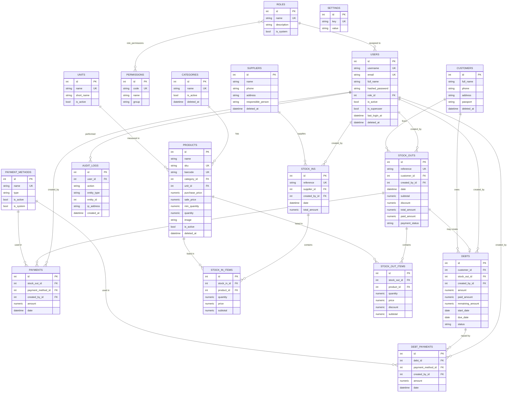

# Database ER Diagram — Ombor Boshqaruv Tizimi

Bu hujjat ma'lumotlar bazasi sxemasini tavsiflaydi. Diagramma [Mermaid](https://mermaid.js.org/)
formatida yozilgan (GitHub uni avtomatik render qiladi).

## Umumiy tamoyillar

- **Normalization**: 3NF ga muvofiq. Takrorlanuvchi ma'lumotlar alohida jadvallarga ajratilgan.
- **Foreign Keys**: barcha bog'lanishlar FK bilan ta'minlangan, mos `ondelete` qoidalari bilan.
- **Indexes**: tez-tez qidiriladigan/filtrlanadigan ustunlar (`sku`, `barcode`, `phone`, `date`,
  `status`, FK lar) indekslangan.
- **Cascade**: hujjat qatorlari (`stock_in_items`, `stock_out_items`, `payments`, `debt_payments`)
  ota yozuv o'chirilganda `CASCADE` bilan o'chadi. Ma'lumotnoma jadvallariga (`products`,
  `categories`, `units`, ...) `RESTRICT` qo'yilgan — noto'g'ri o'chirishning oldini oladi.
- **Soft Delete**: `users`, `products`, `categories`, `suppliers`, `customers` da `deleted_at`
  ustuni bor — yozuvlar fizik o'chirilmasdan "arxivlanadi".
- **Money/Qty**: pul `NUMERIC(14,2)`, miqdor `NUMERIC(14,3)` (kg kabi kasrli birliklar uchun).

## Diagramma

## Jadvallar ro'yxati (18 ta)

| # | Jadval | Tavsif |
|---|--------|--------|
| 1 | `roles` | Rollar (admin, manager, ...) |
| 2 | `permissions` | Mayda ruxsatlar (product.create, ...) |
| 3 | `role_permissions` | Rol–ruxsat bog'lanishi (M:N) |
| 4 | `users` | Foydalanuvchilar |
| 5 | `categories` | Mahsulot kategoriyalari |
| 6 | `units` | O'lchov birliklari |
| 7 | `products` | Mahsulotlar |
| 8 | `suppliers` | Yetkazib beruvchilar |
| 9 | `customers` | Fermerlar / mijozlar |
| 10 | `stock_ins` | Kirim hujjatlari |
| 11 | `stock_in_items` | Kirim qatorlari |
| 12 | `stock_outs` | Chiqim (savdo) hujjatlari |
| 13 | `stock_out_items` | Chiqim qatorlari |
| 14 | `payment_methods` | To'lov turlari |
| 15 | `payments` | Savdo to'lovlari (aralash to'lov) |
| 16 | `debts` | Qarzlar |
| 17 | `debt_payments` | Qarz to'lovlari tarixi |
| 18 | `settings` | Tizim sozlamalari (key/value) |
| 19 | `audit_logs` | Audit jurnali |
